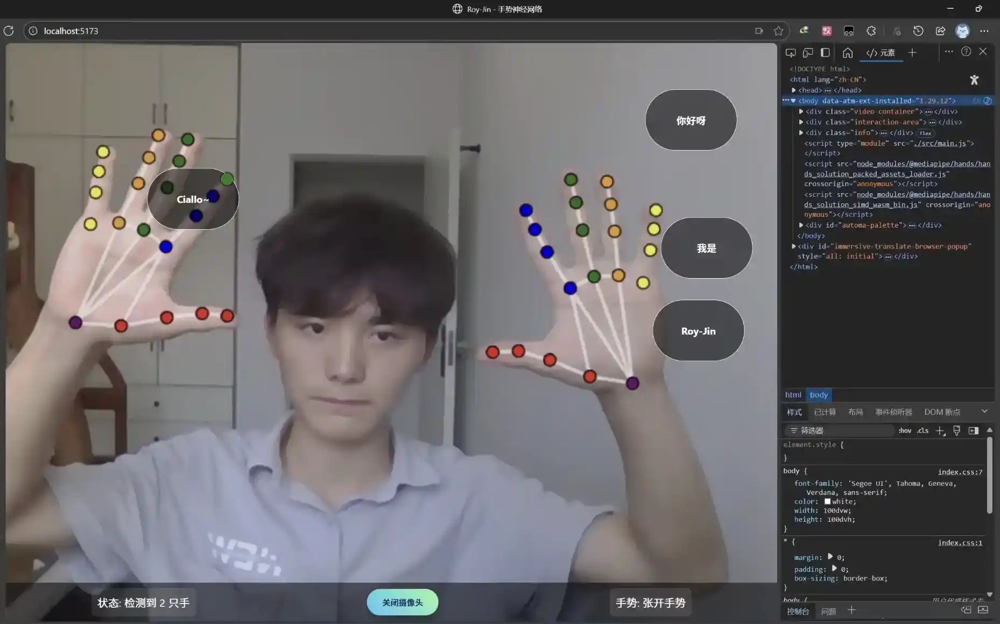

<div align="center">

# ✋ Gesture Recognition

[](https://github.com/Roy-Jin/Gesture-Recognition/stargazers)
[](https://github.com/Roy-Jin/Gesture-Recognition/issues)
[](LICENSE)


A real-time gesture recognition demo built with TensorFlowJs + Mediapipe Hands.  
[English](README.md) | [中文](README_CN.md)
</div>

<details>
  <summary>📑 Table of Contents</summary>
  <ol>
    <li><a href="#-about-the-project">About The Project</a></li>
    <li><a href="#-core-features">Core Features</a></li>
    <li><a href="#-technologies-used">Technologies Used</a></li>
    <li><a href="#-project-structure">Project Structure</a></li>
    <li><a href="#-getting-started">Getting Started</a></li>
    <li><a href="#-usage">Usage</a></li>
    <li><a href="#-license">License</a></li>
    <li><a href="#-contact">Contact</a></li>
  </ol>
</details>

## 🧐 About The Project

<div align="center">
  
</div>

## ✨ Core Features

- **Gesture Recognition** - Precise hand detection and gesture classification.
- **Object Interaction** - PVirtual object manipulation with gestures.
- **Voice Feedback** -Real-time voice responses to user actions.

## 🛠 Technologies Used

- [Node.js](https://nodejs.org/en) - Runtime environment
- [Vite](https://vitejs.dev) - Next generation frontend tooling
- [TensorFlow.js](https://www.tensorflow.org/js) - Machine learning library
- [Mediapipe Hands](https://google.github.io/mediapipe/solutions/hands) - Hand tracking
- [Web Speech API](https://developer.mozilla.org/en-US/docs/Web/API/Web_Speech_API) - Voice synthesis

## 🗂 Project Structure
<details>
<summary>Gesture-Recognition/</summary>

```
├── src/
│   ├── js/
│   │   ├── camera.js       # Camera handling logic
│   │   ├── detector.js     # Gesture detection
│   │   ├── interaction.js  # Object interaction
│   │   ├── renderer.js     # Rendering logic
│   │   ├── utils.js        # Utility functions
│   │   └── voice.js        # Voice feedback
│   ├── index.css
│   └── main.js
├── index.html
├── package.json
└── README.md
```
</details>

## 🚀 Getting Started

### Prerequisites
- [Node.js](https://nodejs.org/en/download) >= 14.x

### Installation
1. Clone the repo
   ```sh
   git clone https://github.com/Roy-Jin/Gesture-Recognition.git
   ```
2. Install NPM packages
   ```sh
   cd Gesture-Recognition
   npm install
   ```

## 🖥️ Usage

1. **Start the application**
   ```sh
   npm run dev
   ```
2. **Open your browser** to `http://localhost:5173`
3. **Allow camera access** when prompted
4. **Interact** with the virtual objects using hand gestures

> **Note:** For best results, use in a well-lit environment and ensure your hands are clearly visible to the camera.

## 📜 License

Distributed under the Apache License. See [`LICENSE`](LICENSE) for more information.

## 📬 Contact

Roy-Jin - [jinroy@outlook.com](mailto:jinroy@outlook.com)