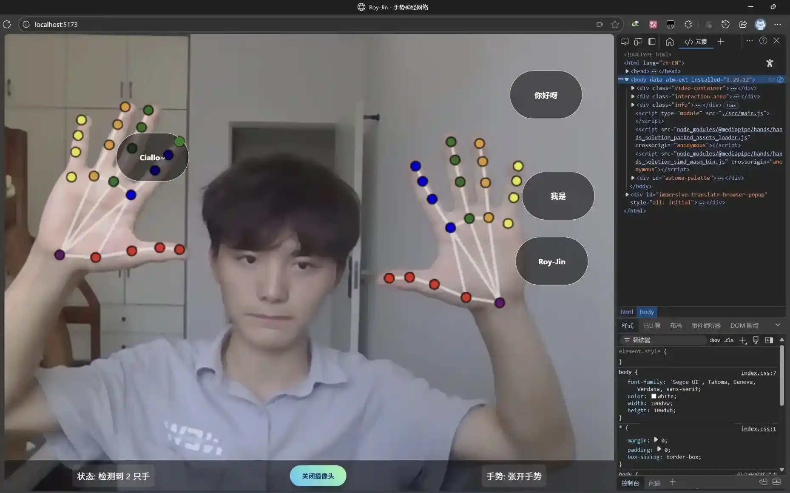

<div align="center">

# ✋ Gesture-Recognition

[](https://github.com/Roy-Jin/Gesture-Recognition/stargazers)
[](https://github.com/Roy-Jin/Gesture-Recognition/issues)
[](LICENSE)
  

基于TensorFlowJs + Mediapipe Hands的实时手势识别演示  
[English](README.md) | [中文](README_CN.md)
</div>

<details>
  <summary>📑 目录</summary>
  <ol>
    <li><a href="#-项目介绍">项目介绍</a></li>
    <li><a href="#-功能特性">功能特性</a></li>
    <li><a href="#-技术栈">技术栈</a></li>
    <li><a href="#-项目结构">项目结构</a></li>
    <li><a href="#-快速开始">快速开始</a></li>
    <li><a href="#-使用指南">使用指南</a></li>
    <li><a href="#-许可证">许可证</a></li>
    <li><a href="#-联系方式">联系方式</a></li>
  </ol>
</details>

## 🧐 项目介绍

<div align="center">
  
</div>

## ✨ 功能特性

- **手势识别** - 精确的手部检测和手势分类
- **物体交互** - 通过手势操作虚拟物体
- **语音反馈** - 对用户操作的实时语音响应

## 🛠 技术栈

- [Node.js](https://nodejs.org/en/) - 运行时环境
- [Vite](https://vitejs.dev/) - 新一代前端构建工具
- [TensorFlow.js](https://www.tensorflow.org/js) - 机器学习库
- [Mediapipe Hands](https://google.github.io/mediapipe/solutions/hands) - 手部追踪
- [Web Speech API](https://developer.mozilla.org/en-US/docs/Web/API/Web_Speech_API) - 语音合成

## 🗂 项目结构

<details>
  <summary>Gesture-Recognition/</summary>

```
├── src/
│   ├── js/
│   │   ├── camera.js       # 摄像头处理逻辑
│   │   ├── detector.js     # 手势检测
│   │   ├── interaction.js  # 物体交互
│   │   ├── renderer.js     # 渲染逻辑
│   │   ├── utils.js        # 工具函数
│   │   └── voice.js        # 语音反馈
│   ├── index.css
│   └── main.js
├── index.html
├── package.json
└── README.md
```
</details>

## 🚀 快速开始

### 环境要求
- [Node.js](https://nodejs.org/en/download) >= 14.x

### 安装步骤
1. 克隆仓库
   ```sh
   git clone https://github.com/Roy-Jin/Gesture-Recognition.git
   ```
2. 安装依赖
   ```sh
   cd Gesture-Recognition
   npm install
   ```

## 🖥️ 使用指南

1. **启动应用**
   ```sh
   npm run dev
   ```
2. **打开浏览器**访问 `http://localhost:5173`
3. **允许摄像头**权限
4. **开始交互**
   - 使用手势操作虚拟物体

> **注意:** 为了获得最佳效果，请在光线充足的环境中使用，并确保手部清晰可见。

## 📜 许可证

本项目采用 Apache 许可证 - 详情请参阅 [`LICENSE`](LICENSE) 文件。

## 📬 联系方式

Roy-Jin - [jinroy@outlook.com](mailto:jinroy@outlook.com)